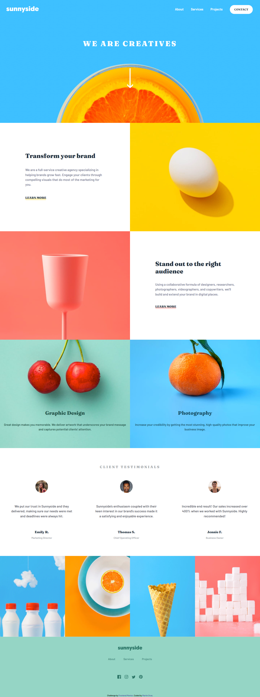

# Frontend Mentor - Sunnyside agency landing page solution

This is a solution to the [Sunnyside agency landing page challenge on Frontend Mentor](https://www.frontendmentor.io/challenges/sunnyside-agency-landing-page-7yVs3B6ef). Frontend Mentor challenges help you improve your coding skills by building realistic projects.

## Table of contents

- [Overview](#overview)
  - [The challenge](#the-challenge)
  - [Screenshot](#screenshot)
  - [Links](#links)
- [My process](#my-process)
  - [Built with](#built-with)
  - [What I learned](#what-i-learned)
  - [Questions](#questions)
  - [Continued development](#continued-development)
  - [Useful resources](#useful-resources)
- [Author](#author)
- [Acknowledgments](#acknowledgments)

## Overview

This is my first project using SASS and I made a huge effort in order to follow the good practices, such as [using @forward and @use instead of @import](https://sass-lang.com/documentation/at-rules/import#:~:text=The%20Sass%20team%20discourages%20the%20continued%20use%20of%20the%20%40import%20rule.)

### The challenge

Users should be able to:

- View the optimal layout for the site depending on their device's screen size
- See hover states for all interactive elements on the page

### Screenshot

### Links

- Solution URL: [Add solution URL here](https://github.com/martinorue/Sunnyside-agency-landing-page)
- Live Site URL: [Add live site URL here](https://martinorue.github.io/Sunnyside-agency-landing-page)

## My process

This is my first project using SASS. As it was going to be a bigger project, I wanted to tackle a technology that would allow me to have the code more organized, and I think I succeeded. Soon I would like to learn how to handle media queries with SASS and understand a bit better the differences between @import and @use. And to learn how to use more advanced concepts like Mixins.

### Built with

- Semantic HTML5 markup
- Flexbox
- CSS Grid
- Mobile-first workflow
- SASS

### What I learned

- Sass
 - The use of @use and @forward instead of @import (deprecated)
- How to make an accessible modal menu hamburger style
- I wasted a lot of time trying to adjust the background image for the header. Then I realized I was using the desktop image instead of the mobile one. The lesson to be learned is to always make sure you are using the right image and don't get stuck on a problem for hours, just move on with the rest.
- Absolute Positioning
- How to change the fill attr of an SVG image

### Continued development

- Learn the ARIA roles and attributes to make my sites more a accessible
- Learn CSS animations
- Learn more SASS advanced concepts

### Useful resources

- [Stop using @import with Sass | @use and @forward explained](https://www.youtube.com/watch?v=CR-a8upNjJ0&list=PL4-IK0AVhVjMYRhK9vRPatSlb-9r0aKgh&index=3)
- [CSS Triangle](https://css-tricks.com/snippets/css/css-triangle/)

## Author

- Frontend Mentor - [@martinorue](https://www.frontendmentor.io/profile/martinorue)

## Acknowledgments

[This](https://github.com/joshuacba08/convirtiendo-un-proyecto-de-CSS-a-SASS) repository from Josué Oroya gave me the idea of using absolute positioning for the Services section and to know how to apply hover on an SVG image.
Así que, si algún día lees esto, te mando un saludo desde Uruguay.